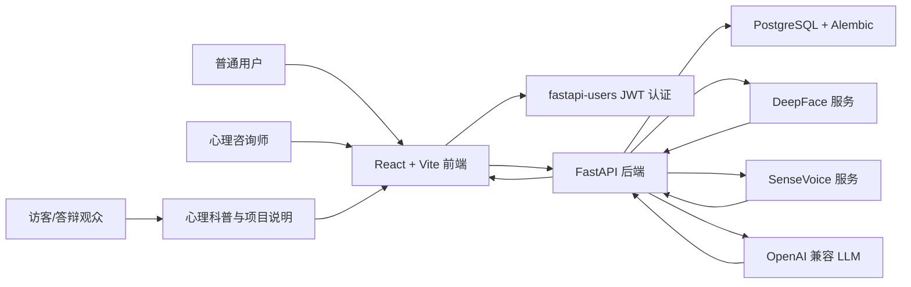
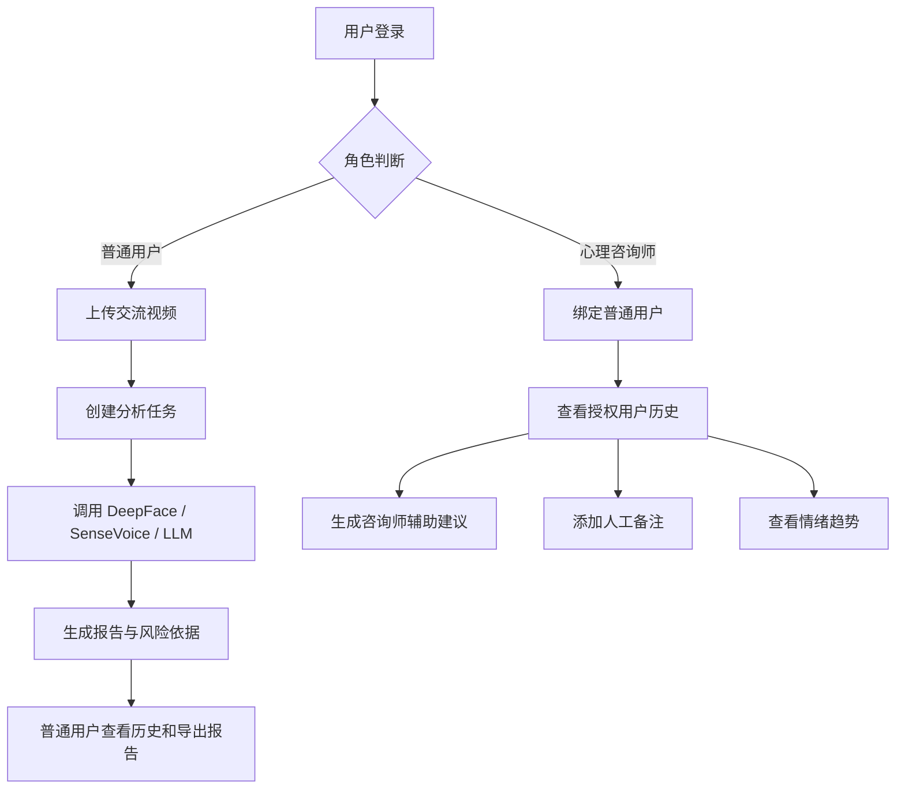
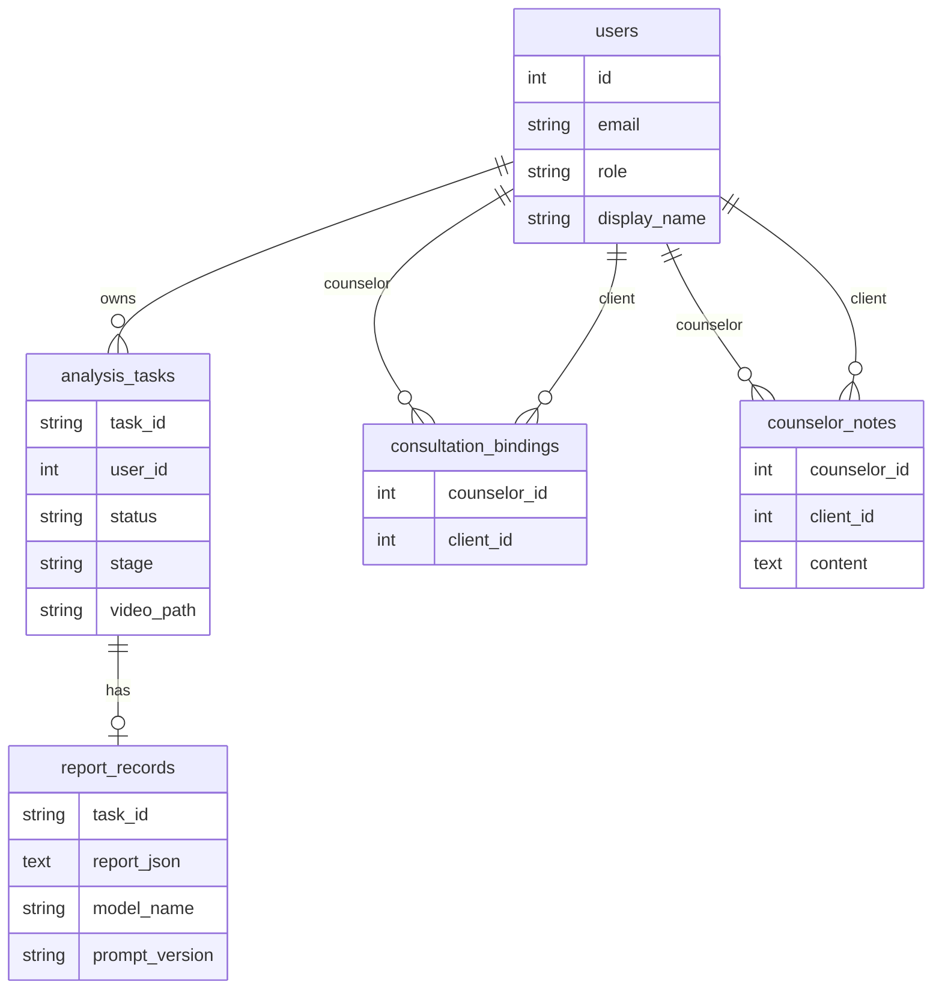

# 架构说明

系统采用前后端分离、模型服务解耦和数据库持久化架构。

## 服务职责

- `frontend`：登录、站内导航、角色工作台、心理科普、项目说明、视频上传、任务状态轮询、历史和报告展示。
- `backend`：基于 FastAPI 和 fastapi-users 的认证授权、任务编排、视频处理、特征融合、报告持久化、LLM 调用。
- `deepface`：读取抽帧结果，使用真实 DeepFace 进行人脸检测、表情概率和持续时长分析。
- `sensevoice`：读取后端提取的音频，使用 FunASR SenseVoiceSmall 进行语音转写、语音侧情绪标签解析，并计算基础声学特征。
- `postgres`：默认 PostgreSQL 数据库，记录用户、咨询师绑定关系、分析任务和报告 JSON；表结构由 Alembic 管理。

## 课程设计流程图

## 数据流

1. 用户通过 fastapi-users 登录，后端签发 Bearer token。
2. 普通用户调用 `POST /api/videos/upload` 上传交流视频。
3. 后端保存视频到 `storage/uploads`，创建绑定到当前用户的任务 ID。
4. 后端从视频中抽取关键帧到 `storage/frames/{task_id}`。
5. 后端从视频中提取音频到 `storage/audio/{task_id}.wav`。
6. 后端调用 DeepFace 服务分析帧级表情。
7. 后端调用 SenseVoice 服务分析音频。
8. 后端融合视觉、语音和声学信息。
9. 后端调用 OpenAI 兼容接口生成普通用户侧专家意见。
10. 后端保存任务和报告到数据库，同时保留 `storage/reports/{task_id}.json` 兼容文件。
11. 心理咨询师只能查看已绑定普通用户的历史，并可生成咨询师辅助建议草稿。

## 业务流程图

## 数据库关系图

## 权限边界

- `client`：只能上传自己的视频、查看自己的任务和报告。
- `counselor`：只能查看已关联普通用户的历史和报告，不能上传视频。
- `心理科普` 和 `项目说明` 为前端静态展示页面，不提供诊断、自测或治疗建议。
- 自动建议均为辅助、非诊断性内容，咨询师辅助草稿仅供专业人员参考。

## 前端展示结构

- `工作台`：登录后按角色展示普通用户上传分析流程或心理咨询师辅助工作流。
- `心理科普`：展示常见心理问题的基础知识、求助提示和非诊断性声明。
- `项目说明`：面向课程答辩说明系统架构、权限控制和论文/PPT资料入口。
- 静态配图位于 `frontend/public/images/`，用于首页和科普页，避免答辩现场依赖外链图片。

## 工程边界

- 后台分析仍使用 FastAPI `BackgroundTasks`，适合课程设计演示；暂不引入 Celery/RQ，避免系统复杂度超过课程要求。
- 数据库结构由 Alembic 管理，后续新增字段或表都应增加迁移文件。
- 运行时文件保存在 `storage/`；普通用户可删除自己的已完成或失败任务，系统会清理对应视频、音频、抽帧目录和报告 JSON。
- 日志只记录任务状态和服务状态，不应输出 token、API Key 或完整敏感咨询文本。

## 替换真实模型

DeepFace 已接入真实 `deepface` Python 包，SenseVoice 已接入 FunASR `iic/SenseVoiceSmall`，并保持 HTTP 接口不变：

- DeepFace：`POST /analyze`
- SenseVoice：`POST /analyze`
