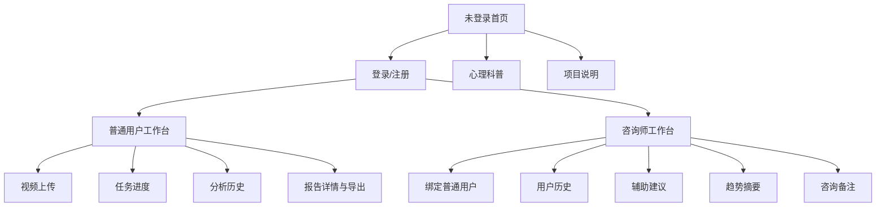

# 多模态心理咨询辅助系统原型设计说明书

## 1. 文档信息

- 文档版本：v1.0
- 编写日期：2026-06-14
- 原型形态：React + Vite 可运行前端页面
- 访问地址：`http://localhost:5173`

## 2. 原型目标

原型用于展示系统从普通用户上传视频到生成多模态报告，以及心理咨询师查看历史、生成辅助建议和维护备注的完整流程。原型强调课程答辩可演示性、功能闭环和非诊断性边界。

## 3. 信息架构

## 4. 页面设计

### 4.1 未登录首页

目标：

- 说明系统定位。
- 引导用户登录或注册。
- 提供心理科普和项目说明入口。

核心元素：

- 顶部导航。
- 品牌与系统名称。
- 登录注册面板。
- 首页配图 `frontend/public/images/hero-counseling.png`。

### 4.2 普通用户工作台

目标：

- 上传交流视频。
- 查看任务处理进度。
- 查看历史报告。
- 导出报告。
- 查看已授权咨询师。

核心组件：

- 视频选择控件。
- 上传按钮。
- 文件大小和类型提示。
- 任务状态进度条。
- 处理步骤列表。
- 历史任务列表。
- 报告详情区。

### 4.3 报告详情页

目标：

- 展示视频摘要、表情分析、语音分析、综合预判和专家意见。
- 强调报告仅供辅助参考。
- 支持 JSON 和文本导出。
- 支持截图模式用于答辩材料。

展示内容：

- 视频时长、抽帧数量、检测人脸、语音检测。
- 主情绪、置信度、风险等级。
- 证据列表和风险依据。
- 表情平均概率与持续时长比例。
- 语音转写、语义情绪、基频、语速、清晰度和声学明细。
- 模型名、prompt 版本和生成时间。
- 非诊断性声明。

### 4.4 心理咨询师工作台

目标：

- 管理绑定普通用户。
- 查看用户历史和报告。
- 生成咨询师辅助建议。
- 添加人工备注。
- 查看风险趋势摘要。

核心组件：

- 邮箱绑定表单。
- 关联用户列表。
- 用户历史列表。
- 辅助建议生成按钮。
- 趋势图。
- 咨询备注输入框与列表。

### 4.5 心理科普页

目标：

- 提供常见心理问题基础知识。
- 提醒用户识别求助信号。
- 明确系统不能替代专业诊断。

主题：

- 抑郁相关问题。
- 焦虑相关问题。
- 睡眠问题。
- 压力与适应问题。
- 创伤后应激相关问题。
- 强迫相关问题。

配图：

- `frontend/public/images/education-mental-health.png`

### 4.6 项目说明页

目标：

- 面向课程答辩说明系统架构、技术路线、权限边界和文档入口。

内容：

- 系统模块。
- 数据流。
- 模型服务。
- 非诊断性声明。
- 小论文和 PPT 资料入口。

## 5. 交互设计

| 场景 | 交互方式 |
| --- | --- |
| 登录注册 | 表单提交，失败后展示错误条 |
| 上传视频 | 选择文件后展示文件元信息，提交后进入轮询 |
| 任务处理 | 进度条、步骤图标和状态文案同步变化 |
| 查看报告 | 点击历史任务或上传完成后自动展示 |
| 导出报告 | 点击导出 JSON 或导出文本按钮触发浏览器下载 |
| 删除任务 | 二次确认后删除，处理中任务按钮禁用 |
| 绑定用户 | 咨询师输入普通用户邮箱并提交 |
| 生成辅助建议 | 选中用户后点击按钮，生成结果写入最近报告记录 |
| 添加备注 | 输入备注并提交，列表按时间倒序展示 |

## 6. 视觉设计

- 采用工作台式布局，避免纯营销式页面。
- 使用 Lucide React 图标增强按钮和信息模块识别度。
- 报告内容采用卡片式分区，便于答辩截图和快速阅读。
- 风险等级通过文字和样式区分，但避免制造诊断暗示。
- 顶部导航保持固定的信息层级：工作台、心理科普、项目说明。

## 7. 原型截图资料

已有截图资料位于 `docs/截图`：

| 截图 | 说明 |
| --- | --- |
| `注册登录页.png` | 未登录和认证入口 |
| `用户工作台页面.png` | 普通用户工作台 |
| `上传视频并分析页面.png` | 上传与分析流程 |
| `普通用户历史页.png` | 普通用户历史记录 |
| `报告详情页.png` | 完整报告详情 |
| `报告缩略版.png` | 报告截图模式或摘要展示 |
| `咨询师工作台.png` | 咨询师绑定、历史、备注和趋势 |
| `科普页.png` | 心理科普页面 |
| `接口分组表.png` | API 分组展示 |
| `Doker服务状态.png` | Docker 服务运行状态截图 |

## 8. 可用性要求

- 用户在未登录时仍可查看心理科普和项目说明。
- 普通用户上传后无需刷新页面即可看到任务进度。
- 任务失败时需要展示明确错误信息。
- 报告页面应同时服务普通用户阅读和课程答辩截图。
- 咨询师工作台必须先选择或绑定用户，再查看历史和生成辅助建议。

## 9. 原型限制

- 当前原型未实现移动端专门优化，但布局应保持基本可读。
- 绑定用户采用咨询师输入用户邮箱方式，适合课程演示；生产环境建议增加用户授权确认流程。
- 趋势图为简化风险等级趋势，不替代临床量表和长期评估。

