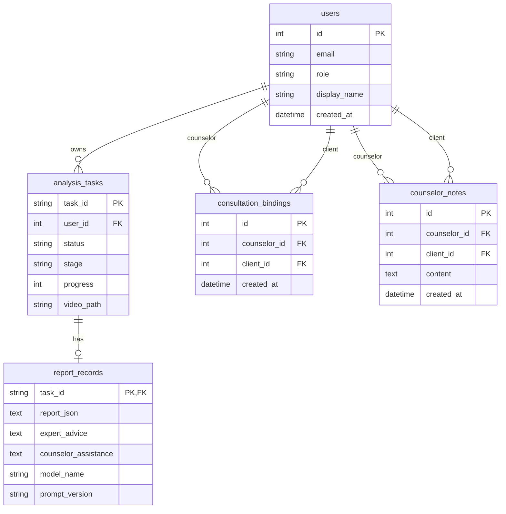

# 多模态心理咨询辅助系统数据库设计说明书

## 1. 文档信息

- 文档版本：v1.0
- 编写日期：2026-06-14
- 数据库：PostgreSQL 16
- ORM：SQLAlchemy Async
- 迁移工具：Alembic

## 2. 数据库概述

系统使用 PostgreSQL 保存用户、任务、报告、咨询师绑定关系和人工备注。运行时视频、抽帧、音频和兼容报告 JSON 存放在本地 `storage` 目录，数据库中保存文件路径和结构化报告内容。

## 3. ER 图



## 4. 表结构设计

### 4.1 users

用户表继承 fastapi-users 的 SQLAlchemy 用户表，包含认证字段和业务字段。

| 字段 | 类型 | 约束 | 说明 |
| --- | --- | --- | --- |
| `id` | Integer | PK, index | 用户 ID |
| `email` | String | unique | 登录邮箱 |
| `hashed_password` | String | not null | 密码哈希 |
| `is_active` | Boolean | not null | 是否启用 |
| `is_superuser` | Boolean | not null | 是否超级用户 |
| `is_verified` | Boolean | not null | 是否已验证 |
| `role` | String(24) | not null, default `client` | 用户角色，`client` 或 `counselor` |
| `display_name` | String(120) | nullable | 显示名称 |
| `created_at` | DateTime | not null | 创建时间 |

### 4.2 analysis_tasks

视频分析任务表。

| 字段 | 类型 | 约束 | 说明 |
| --- | --- | --- | --- |
| `task_id` | String(64) | PK | UUID 字符串 |
| `user_id` | Integer | FK `users.id`, index | 任务所属普通用户 |
| `status` | String(24) | not null | `queued`、`processing`、`completed`、`failed` |
| `stage` | String(48) | not null | 当前处理阶段 |
| `progress` | Integer | not null | 0 到 100 的进度 |
| `message` | String(240) | not null | 用户可见状态消息 |
| `error` | Text | nullable | 失败原因 |
| `video_path` | String(500) | not null | 上传视频本地路径 |
| `created_at` | DateTime | not null | 创建时间 |
| `updated_at` | DateTime | not null | 更新时间 |

### 4.3 report_records

报告记录表，与任务一对一。

| 字段 | 类型 | 约束 | 说明 |
| --- | --- | --- | --- |
| `task_id` | String | PK, FK `analysis_tasks.task_id` | 对应任务 |
| `report_json` | Text | not null | 完整报告 JSON |
| `expert_advice` | Text | not null | 普通用户侧专家意见 |
| `counselor_assistance` | Text | nullable | 咨询师辅助建议草稿 |
| `counselor_assistance_created_at` | DateTime | nullable | 辅助建议生成时间 |
| `model_name` | String(120) | nullable | LLM 模型名 |
| `prompt_version` | String(40) | nullable | Prompt 版本 |
| `created_at` | DateTime | not null | 报告创建时间 |

### 4.4 consultation_bindings

咨询师与普通用户绑定关系表。

| 字段 | 类型 | 约束 | 说明 |
| --- | --- | --- | --- |
| `id` | Integer | PK | 绑定 ID |
| `counselor_id` | Integer | FK `users.id`, index | 咨询师用户 ID |
| `client_id` | Integer | FK `users.id`, index | 普通用户 ID |
| `created_at` | DateTime | not null | 绑定时间 |

唯一约束：

- `uq_counselor_client(counselor_id, client_id)`：避免重复绑定。

### 4.5 counselor_notes

咨询师人工备注表。

| 字段 | 类型 | 约束 | 说明 |
| --- | --- | --- | --- |
| `id` | Integer | PK | 备注 ID |
| `counselor_id` | Integer | FK `users.id`, index | 咨询师 ID |
| `client_id` | Integer | FK `users.id`, index | 普通用户 ID |
| `content` | Text | not null | 备注内容 |
| `created_at` | DateTime | not null | 创建时间 |

## 5. 关系与权限约束

- 一个普通用户可以拥有多个分析任务。
- 一个分析任务最多对应一个报告。
- 一个咨询师可以绑定多个普通用户。
- 一个普通用户可以被多个咨询师绑定。
- 咨询师只能访问自己已绑定普通用户的数据。
- 普通用户只能访问自己的任务和报告。

## 6. 索引设计

| 表 | 索引字段 | 用途 |
| --- | --- | --- |
| `users` | `id`、`email` | 用户查询和认证 |
| `analysis_tasks` | `user_id` | 查询普通用户历史 |
| `consultation_bindings` | `counselor_id`、`client_id` | 查询绑定关系与权限校验 |
| `counselor_notes` | `counselor_id`、`client_id` | 查询咨询师对指定用户的备注 |

## 7. 数据字典

### 7.1 用户角色

| 值 | 说明 |
| --- | --- |
| `client` | 普通用户 |
| `counselor` | 心理咨询师 |

### 7.2 任务状态

| 值 | 说明 |
| --- | --- |
| `queued` | 已排队 |
| `processing` | 处理中 |
| `completed` | 已完成 |
| `failed` | 失败 |

### 7.3 风险等级

| 值 | 说明 |
| --- | --- |
| `low` | 低风险提示 |
| `medium` | 中风险提示 |
| `high` | 高风险提示，需要优先人工复核 |

## 8. 数据保留与清理

- 运行时文件默认保留在 `storage` 目录，便于课程演示复核。
- 普通用户可以删除自己的已完成或失败任务，系统同时删除数据库记录和本地文件。
- 生产环境建议增加定期归档、加密存储、访问审计和文件生命周期策略。

## 9. 迁移管理

数据库变更通过 Alembic 迁移管理。部署或启动后端容器时执行：

```powershell
alembic upgrade head
```

新增字段或新表时，应创建新的迁移文件，不应直接手工修改生产数据库结构。

