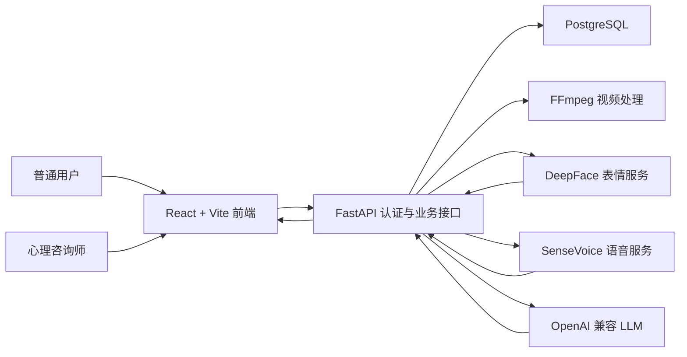

# 多模态心理咨询辅助系统概要设计说明书

## 1. 文档信息

- 文档版本：v1.0
- 编写日期：2026-06-14
- 适用项目：多模态心理咨询辅助系统
- 适用阶段：课程设计、原型演示、系统验收

## 2. 项目概述

多模态心理咨询辅助系统面向心理健康沟通场景，支持普通用户上传交流视频，系统自动完成视频抽帧、音频提取、人脸表情分析、语音转写、声学特征分析、按模态质量动态加权的多模态融合和专家意见生成。系统输出仅作为心理健康沟通线索和专业复核参考，不替代医学诊断、治疗或危机干预。

系统同时提供心理咨询师工作台。咨询师可以绑定已授权普通用户，查看用户历史分析记录、趋势摘要、生成咨询辅助建议草稿并记录人工备注。

## 3. 建设目标

- 建立端到端视频分析流程，完成从上传到报告展示的闭环。
- 将人脸表情、语音语义、声学特征和大语言模型建议组合为多模态辅助报告，并根据模态质量动态调整融合权重。
- 支持普通用户和心理咨询师两类角色的权限隔离。
- 支持任务状态追踪、历史记录、报告导出、咨询备注和趋势查看。
- 为课程答辩提供稳定演示环境、截图资料、部署方案和验收方案。

## 4. 总体架构

系统采用前后端分离、模型服务解耦、数据库持久化架构。

## 5. 系统组成

| 子系统 | 技术栈 | 主要职责 |
| --- | --- | --- |
| 前端系统 | React、Vite、Lucide React | 登录注册、工作台、视频上传、任务轮询、报告展示、心理科普、项目说明 |
| 后端系统 | FastAPI、fastapi-users、SQLAlchemy Async | 认证授权、任务管理、报告持久化、权限校验、模型服务编排 |
| 表情分析服务 | DeepFace、FastAPI | 读取抽帧图片，输出主导表情、平均概率、持续时长比例 |
| 语音分析服务 | FunASR SenseVoiceSmall、FastAPI | 语音转写、语义情绪标签、声学特征估计 |
| 数据库 | PostgreSQL、Alembic | 用户、任务、报告、绑定关系、咨询备注存储 |
| 文件存储 | 本地 `storage` 目录 | 上传视频、抽帧图片、音频文件、兼容报告 JSON |
| 部署环境 | Docker Compose | 编排前端、后端、模型服务和数据库 |

## 6. 主要业务流程

### 6.1 普通用户分析流程

1. 用户注册或登录。
2. 用户上传视频文件。
3. 后端保存视频并创建分析任务。
4. 后端后台任务调用 FFmpeg 抽帧并提取音频。
5. 后端调用 DeepFace 服务分析表情。
6. 后端调用 SenseVoice 服务分析语音。
7. 后端按模态质量动态融合多模态特征，得到主情绪、置信度和风险等级。
8. 后端调用大语言模型生成非诊断性专家意见。
9. 后端保存报告到数据库和本地 JSON 文件。
10. 前端轮询任务状态并展示报告。

### 6.2 咨询师辅助流程

1. 咨询师登录系统。
2. 咨询师通过普通用户邮箱建立绑定关系。
3. 咨询师查看已绑定用户的历史分析记录。
4. 咨询师打开报告、查看趋势摘要并添加人工备注。
5. 咨询师基于历史报告生成辅助建议草稿。

## 7. 权限设计

| 角色 | 权限 |
| --- | --- |
| 未登录访客 | 浏览心理科普、项目说明、登录注册页面 |
| 普通用户 | 上传自己的视频、查看自己的任务和报告、导出报告、删除已完成或失败任务、查看已授权咨询师 |
| 心理咨询师 | 绑定普通用户、查看绑定用户历史和报告、生成辅助建议、维护咨询备注、查看趋势摘要 |

权限控制原则：

- 普通用户只能访问 `user_id` 等于自己的任务和报告。
- 咨询师只能访问已建立绑定关系的普通用户数据。
- 处理中任务不能删除，避免后台处理过程与文件清理冲突。
- 所有自动输出均需要保留非诊断性声明。

## 8. 数据设计概要

核心实体包括：

- `users`：系统用户，包含角色和显示名称。
- `analysis_tasks`：视频分析任务，记录状态、进度、阶段和视频路径。
- `report_records`：分析报告，保存完整 JSON、专家意见、模型名和 prompt 版本。
- `consultation_bindings`：咨询师与普通用户绑定关系。
- `counselor_notes`：咨询师人工备注。

数据库结构由 Alembic 迁移管理，运行时文件保存在 `storage/uploads`、`storage/frames`、`storage/audio` 和 `storage/reports`。

## 9. 外部接口概要

| 接口类型 | 说明 |
| --- | --- |
| 认证接口 | 注册、JWT 登录、获取当前用户 |
| 普通用户接口 | 上传视频、查询任务、查看历史、删除任务、查看授权咨询师 |
| 报告接口 | 查看报告、导出 JSON 或文本报告 |
| 咨询师接口 | 绑定用户、查看用户历史、生成辅助建议、备注、趋势 |
| 模型服务接口 | 后端内部调用 DeepFace `/analyze` 和 SenseVoice `/analyze` |

## 10. 非功能设计

- 可用性：Docker Compose 一键启动，演示账号自动创建。
- 可维护性：业务服务按 `task_service`、`video_service`、`face_service`、`speech_service`、`fusion_service`、`llm_service` 拆分。
- 可追溯性：报告记录模型名、prompt 版本、生成时间和任务 ID。
- 安全性：JWT 鉴权、角色校验、CORS 配置、敏感密钥通过环境变量注入。
- 可扩展性：模型服务通过 HTTP 解耦，后续可替换为更强模型或异步任务队列。

## 11. 约束与边界

- 系统为课程设计原型，不提供医学诊断能力。
- 当前后台分析使用 FastAPI `BackgroundTasks`，适合演示环境；高并发生产场景建议引入 Celery、RQ 或消息队列。
- 文件存储采用本地目录，生产环境建议迁移到对象存储并增加生命周期策略。
- LLM 未配置 API Key 时使用本地兜底建议，保证演示流程可完整运行。
