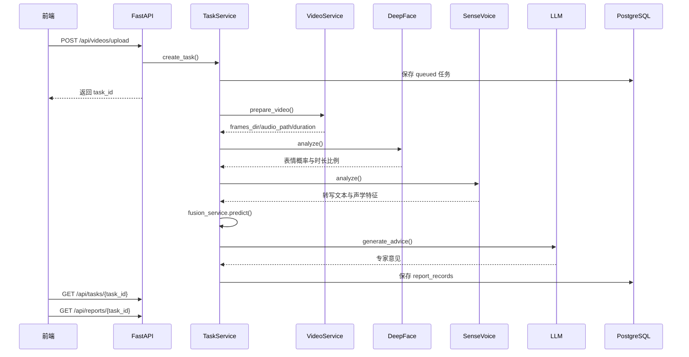

# 多模态心理咨询辅助系统详细设计说明书

## 1. 文档信息

- 文档版本：v1.0
- 编写日期：2026-06-14
- 适用范围：前端、后端、模型服务、任务处理与报告生成模块

## 2. 模块划分

| 模块 | 位置 | 说明 |
| --- | --- | --- |
| 前端入口 | `frontend/src/main.jsx` | React 单页应用，维护认证状态、业务视图和 API 调用 |
| 前端样式 | `frontend/src/styles.css` | 页面布局、工作台、报告、趋势图和响应式样式 |
| 后端入口 | `backend/app/main.py` | FastAPI 应用初始化、路由注册、CORS、中间件和演示数据初始化 |
| API 路由 | `backend/app/api/routes.py` | 健康检查、任务、报告、咨询师相关接口 |
| 用户与认证 | `backend/app/users.py`、`backend/app/api/dependencies.py` | fastapi-users 用户管理、角色依赖校验 |
| 任务服务 | `backend/app/services/task_service.py` | 任务创建、后台处理、报告保存、权限判断、历史查询 |
| 视频服务 | `backend/app/services/video_service.py` | FFmpeg 抽帧、音频提取、时长探测 |
| 表情服务客户端 | `backend/app/services/face_service.py` | 调用 DeepFace 服务 |
| 语音服务客户端 | `backend/app/services/speech_service.py` | 调用 SenseVoice 服务 |
| 融合服务 | `backend/app/services/fusion_service.py` | 构建报告片段，计算主情绪、置信度和风险等级 |
| LLM 服务 | `backend/app/services/llm_service.py` | 生成普通用户专家意见和咨询师辅助草稿 |
| 数据模型 | `backend/app/models/task.py` | SQLAlchemy ORM 模型 |
| 响应模型 | `backend/app/schemas/report.py` | Pydantic 请求与响应结构 |

## 3. 前端详细设计

### 3.1 视图结构

前端为单页应用，顶部导航提供三个视图：

- `工作台`：登录、上传、任务进度、历史、报告和咨询师功能。
- `心理科普`：常见心理问题介绍和求助提示。
- `项目说明`：系统架构、伦理边界和课程展示资料入口。

### 3.2 状态管理

前端使用 React `useState` 和 `useEffect` 管理状态：

| 状态 | 说明 |
| --- | --- |
| `auth` | 本地登录态，保存 JWT 和当前用户信息 |
| `file` | 待上传视频文件 |
| `task` | 当前分析任务 |
| `report` | 当前打开的报告 |
| `history` | 普通用户历史任务 |
| `clients` | 咨询师已绑定用户列表 |
| `selectedClient` | 咨询师当前查看的普通用户 |
| `notes` | 咨询师备注 |
| `trend` | 风险等级趋势点 |
| `error` | 页面错误提示 |

登录态保存于浏览器 `localStorage`，键名为 `emotion-auth`。

### 3.3 API 调用设计

前端通过 `apiFetch` 统一补充 Bearer Token。上传接口使用 `FormData`，报告导出接口使用 Blob 下载。任务轮询默认最多 180 次，每次间隔 1 秒，完成后自动拉取报告。

### 3.4 页面组件设计

| 组件 | 职责 |
| --- | --- |
| `SiteHeader` | 顶部导航、角色状态和退出登录 |
| `HeroSection` | 未登录首页展示 |
| `AuthPanel` | 登录注册 |
| `ClientWorkspace` | 普通用户上传、历史、授权咨询师 |
| `CounselorWorkspace` | 咨询师绑定、历史、备注、趋势和辅助建议 |
| `TaskStatus` | 任务进度条和步骤展示 |
| `ReportView` | 完整报告展示和导出 |
| `TrendPanel` | 咨询师趋势图 |
| `NotesPanelForm` | 咨询师备注表单 |

## 4. 后端详细设计

### 4.1 应用启动

FastAPI 后端启动时完成：

1. 加载配置。
2. 注册 API 路由。
3. 配置 CORS。
4. 初始化数据库表结构和演示账号。
5. 挂载 fastapi-users 认证、注册和用户接口。

### 4.2 配置项

| 配置项 | 默认值 | 说明 |
| --- | --- | --- |
| `OPENAI_BASE_URL` | `https://api.openai.com/v1` | OpenAI 兼容接口地址 |
| `OPENAI_API_KEY` | 空 | LLM API Key |
| `OPENAI_MODEL` | `gpt-4.1-mini` | LLM 模型名 |
| `DEEPFACE_URL` | `http://deepface:8001` | 表情分析服务地址 |
| `SENSEVOICE_URL` | `http://sensevoice:8002` | 语音分析服务地址 |
| `DATABASE_URL` | PostgreSQL 连接串 | 异步数据库连接 |
| `AUTH_SECRET_KEY` | 开发默认值 | JWT 签名密钥 |
| `BACKEND_CORS_ORIGINS` | `http://localhost:5173` | 允许跨域来源 |
| `STORAGE_DIR` | `storage` | 运行时文件根目录 |

### 4.3 任务生命周期

| 状态 | 阶段 | 进度 | 说明 |
| --- | --- | --- | --- |
| `queued` | `queued` | 5 | 已上传，等待处理 |
| `processing` | `preparing_video` | 10 | 抽帧和提取音频 |
| `processing` | `analyzing_face` | 35 | 分析人脸表情 |
| `processing` | `analyzing_speech` | 60 | 分析语音和声学特征 |
| `processing` | `fusing_features` | 78 | 融合多模态特征 |
| `processing` | `generating_advice` | 88 | 生成专家意见 |
| `processing` | `saving_report` | 96 | 保存报告 |
| `completed` | `completed` | 100 | 分析完成 |
| `failed` | 保留失败阶段 | 原进度 | 分析失败并记录错误 |

### 4.4 任务处理时序

## 5. 多模态融合设计

系统当前采用可解释的动态规则融合：

- 人脸表情平均概率基础权重：0.5。
- 人脸表情持续时长比例基础权重：0.2。
- 语音语义情绪基础权重：0.3。
- 根据有效分析帧、跳过帧、表情概率集中度、语义情绪可用性、转写文本长度、音频时长、清晰度和有效语音检测结果计算模态质量。
- 实际融合权重等于基础权重乘以模态质量，并在可用模态之间重新归一化。
- 得分最高的情绪作为综合主情绪。
- 置信度取主情绪融合得分并限制在 0 到 1 之间。

风险等级规则：

- 主情绪为 `angry`、`fear` 或 `sad` 且置信度不低于 0.65 时，风险为 `high`。
- 主情绪为 `angry`、`fear` 或 `sad`，或置信度低于 0.45 时，风险为 `medium`。
- 其他情况风险为 `low`。

## 6. 模型服务设计

### 6.1 DeepFace 服务

- 输入：任务 ID、抽帧目录。
- 输出：主导表情、表情概率、持续时长比例、有效帧数、跳过帧数、处理备注。
- 失败兜底：返回错误信息和 `unknown` 表情，后端继续生成报告。

### 6.2 SenseVoice 服务

- 输入：任务 ID、音频文件路径、视频时长。
- 输出：转写文本、语义情绪、语音标签、基频、语速、清晰度、声学明细和处理备注。
- 失败兜底：返回无语音或未知语音特征，后端继续生成报告。

### 6.3 LLM 服务

- 普通用户报告：生成非诊断性专家意见。
- 咨询师辅助：基于历史报告生成专业人员参考草稿。
- 未配置 API Key：返回本地兜底建议，保证演示不中断。

## 7. 异常处理设计

| 场景 | 处理方式 |
| --- | --- |
| 上传文件不是视频 | 返回 400 和中文错误 |
| 任务不存在 | 返回 404 |
| 无权限访问任务或报告 | 返回 403 |
| 报告尚未生成 | 返回 404 |
| 删除处理中任务 | 返回 409 |
| 模型服务异常 | 写入处理备注或任务失败信息 |
| 后台任务异常 | 任务状态更新为 `failed`，记录错误文本 |

## 8. 文件清理设计

普通用户删除已完成或失败任务时，系统同步清理：

- `storage/uploads/{task_id}.*`
- `storage/audio/{task_id}.wav`
- `storage/frames/{task_id}/`
- `storage/reports/{task_id}.json`
- 数据库中的 `analysis_tasks` 和 `report_records`

## 9. 可追溯设计

报告包含：

- `task_id`
- 视频摘要
- 表情分析结果
- 语音分析结果
- 综合预判
- 专家意见
- `model_name`
- `prompt_version`
- `generated_at`

这些字段用于答辩说明、报告复核和后续问题定位。
